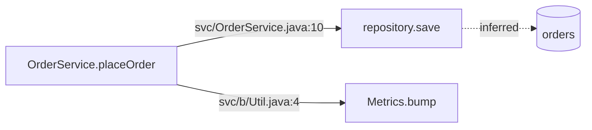

The order flow:

```mermaid
flowchart LR
  S["OrderService.placeOrder"] -->|"svc/OrderService.java:10"| P["repository.save"]
  P -.->|"inferred"| DB[("orders")]
  S -->|"svc/b/Util.java:4"| U["Metrics.bump"]
```
